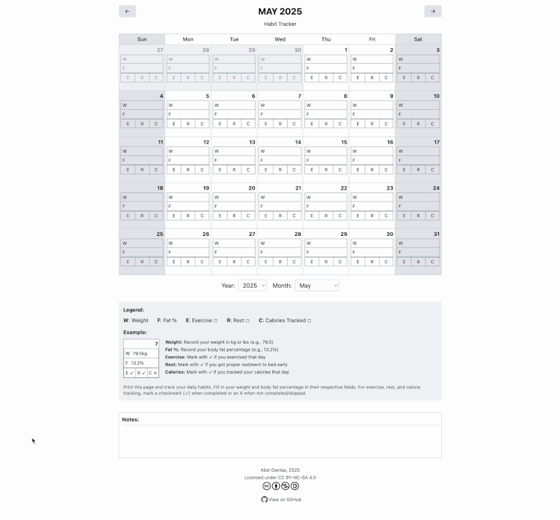

# Printable Habit Tracker Calendar

A habit tracker calendar printout for tracking health and fitness habits.
It's meant to be printed and filled in by hand.

Print yours today here: https://abeldantas.github.io/habit-tracker



- Track daily:
  - Weight
  - Body fat percentage
  - Exercise
  - Rest/early bedtime
  - Calorie tracking
- Days from adjacent months show up for complete weeks
- Printable!

## Development

Uses React and Tailwind.
Has a github workflow to deploy to Github Pages.

### Running Locally

To run this project locally:

1. Clone the repository:
   ```
   git clone https://github.com/yourusername/habit-tracker.git
   cd habit-tracker
   npm install && npm start
   ```

## License

This project is licensed under the [CC BY-NC-SA 4.0 License](https://creativecommons.org/licenses/by-nc-sa/4.0/).

- **Attribution** — You must give appropriate credit to Abel Dantas, provide a link to the license, and indicate if changes were made.
- **NonCommercial** — You may not use the material for commercial purposes.
- **ShareAlike** — If you remix, transform, or build upon the material, you must distribute your contributions under the same license as the original.

See the [LICENSE](./LICENSE) file for more details.